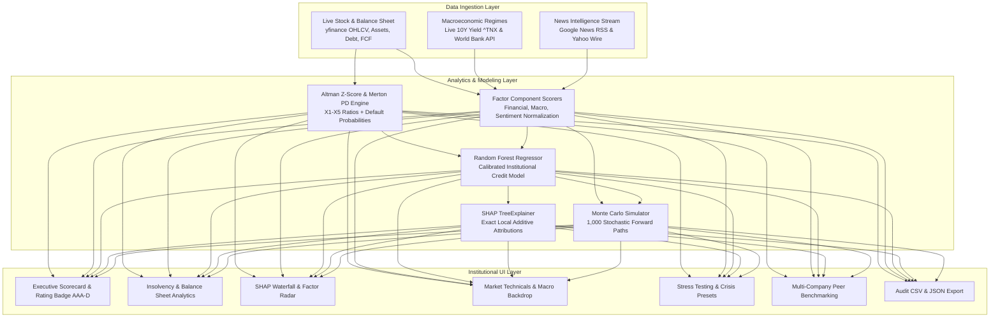

<div align="center">

# 🏦 TransparaScore
### **Institutional-Grade Explainable Credit Intelligence & Risk Analytics Platform**

[](LICENSE)
[](https://www.python.org/)
[](https://streamlit.io/)
[](https://scikit-learn.org/)
[](https://shap.readthedocs.io/)
[](https://transparascore.streamlit.app/)

<p align="center">
  <b>Eliminating black-box credit risk assessment through multi-source data fusion, empirical bankruptcy modeling, SHAP explainability, and stochastic Monte Carlo stress testing.</b>
</p>

---

</div>

## 📑 Table of Contents
- [Executive Overview](#-executive-overview)
- [Key Capabilities & Modules](#-key-capabilities--modules)
- [Methodological & Mathematical Framework](#-methodological--mathematical-framework)
  - [1. Altman Z-Score Bankruptcy Model](#1-altman-z-score-bankruptcy-model)
  - [2. Merton Structural Probability of Default (PD)](#2-merton-structural-probability-of-default-pd)
  - [3. Multi-Factor Risk Aggregation](#3-multi-factor-risk-aggregation)
  - [4. True SHAP Local Feature Attribution](#4-true-shap-local-feature-attribution)
- [System Architecture](#-system-architecture)
- [Repository Structure](#-repository-structure)
- [Installation & Quick Start](#-installation--quick-start)
- [Verification & Automated Testing](#-verification--automated-testing)
- [Stress Testing & Crisis Presets](#-stress-testing--crisis-presets)
- [Configuration & API Governance](#-configuration--api-governance)
- [Author & Acknowledgements](#-author--acknowledgements)
- [License](#-license)

---

## 🏛 Executive Overview

Traditional corporate credit rating systems often operate as opaque "black boxes" with lagging quarterly metrics and subjective committees. **TransparaScore** bridges this gap by delivering a **real-time, auditable, and mathematically grounded credit intelligence scorecard**.

By unifying **real-time equity market dynamics**, **fundamental balance sheet solvency**, **macroeconomic regimes**, and **NLP-driven financial news sentiment**, TransparaScore produces an ensemble credit score ($0\text{--}100$) mapped directly to global rating agency grades (**AAA** down to **D**).

---

## 🌟 Key Capabilities & Modules

| Module | Core Features | Underlying Technology |
| :--- | :--- | :--- |
| **Zero-Friction Ingestion** | Live OHLCV, moving averages, volume, balance sheet fundamentals, and market capitalization with **zero API key requirement**. | `yfinance`, World Bank Open API, Google News RSS, Yahoo Wire |
| **Insolvency & Solvency** | **Altman Z-Score** calculation across 5 financial ratios; Safe/Grey/Distress categorization; **1-Yr & 5-Yr Merton Default Probabilities**. | Empirical Corporate Bankruptcy Models, Merton Structural Framework |
| **Explainable AI (XAI)** | Exact additive local point attributions ($+/-$) via **SHAP TreeExplainer**; Factor Radar visualizer; natural language executive rationale. | `shap.TreeExplainer`, `RandomForestRegressor`, Plotly |
| **Macro Regimes** | Real-time tracking of 10Y US Treasury yields (`^TNX`), CPI YoY inflation, unemployment, and US/India GDP expansion rates. | Federal Reserve (FRED), World Bank National Accounts |
| **News & Sentiment Stream** | Real-time financial headline scraping with domain-specific polarity scoring and event risk classification. | Financial Lexicon NLP Engine, `feedparser` |
| **Monte Carlo Stress Engine** | **1,000-path stochastic forward simulation** for 12-month credit rating drift with **95% Worst-Case VaR**; 1-click macroeconomic crisis presets. | Geometric Brownian Motion with Mean Reversion |
| **Peer Benchmarking** | Side-by-side comparative matrix of 3–5 industry peers across credit rating, Altman Z, default probability, and volatility. | Multi-Ticker Concurrent Vectorization |
| **Audit & Export** | One-click export to regulatory CSV audit trail and structured JSON payload. | Native In-Memory Streamlit Download Stream |

---

## 📐 Methodological & Mathematical Framework

### 1. Altman Z-Score Bankruptcy Model
The platform computes the standard 5-ratio discriminant function developed by Edward Altman:

$$Z = 1.2 X_1 + 1.4 X_2 + 3.3 X_3 + 0.6 X_4 + 0.999 X_5$$

Where:
- $X_1 = \frac{\text{Working Capital}}{\text{Total Assets}}$ (Short-term liquidity buffer)
- $X_2 = \frac{\text{Retained Earnings}}{\text{Total Assets}}$ (Cumulative profitability & age)
- $X_3 = \frac{\text{EBIT}}{\text{Total Assets}}$ (Operating asset productivity)
- $X_4 = \frac{\text{Market Value of Equity}}{\text{Total Liabilities}}$ (Leverage & market solvency)
- $X_5 = \frac{\text{Total Revenue}}{\text{Total Assets}}$ (Asset turnover efficiency)

**Zone Classification:**
- $\mathbf{Z \ge 2.99}$: **Safe Zone** (Minimal insolvency risk)
- $\mathbf{1.81 \le Z < 2.99}$: **Grey Zone** (Moderate vulnerability; active monitoring required)
- $\mathbf{Z < 1.81}$: **Distress Zone** (High empirical probability of bankruptcy)

---

### 2. Merton Structural Probability of Default (PD)
Calibrated to empirical rating agency transition matrices, the 1-year and 5-year cumulative default probabilities are derived from structural asset-to-debt distance:

$$PD_{\text{1-Yr}} = \frac{100}{1 + e^{0.85 \cdot (Z - 1.2)}} \quad [\%]$$

$$PD_{\text{5-Yr}} = 100 \cdot \left[1 - \left(1 - \frac{PD_{\text{1-Yr}}}{100}\right)^{4.2}\right] \quad [\%]$$

---

### 3. Multi-Factor Risk Aggregation
The composite expert rule score combines weighted components:

$$\text{Composite Score} = w_{\text{fin}} \cdot S_{\text{fin}} + w_{\text{mac}} \cdot S_{\text{mac}} + w_{\text{sent}} \cdot S_{\text{sent}}$$

The final score is an ensemble between the Expert Rule Engine and the Random Forest Regressor:

$$\text{Final Score} = 0.55 \cdot \text{Composite Score} + 0.45 \cdot \hat{y}_{\text{ML}}$$

**Credit Rating Tier Mapping:**
- **AAA** ($90\text{--}100$): Prime / Exceptional
- **AA** ($80\text{--}89.9$): High Quality
- **A** ($70\text{--}79.9$): Upper Medium Grade
- **BBB** ($60\text{--}69.9$): Investment Grade Lower Medium
- **BB** ($50\text{--}59.9$): Speculative / High Yield
- **B** ($40\text{--}49.9$): Highly Speculative
- **CCC** ($25\text{--}39.9$): Substantial Risk
- **D** ($< 25$): Default / Imminent Distress

---

### 4. True SHAP Local Feature Attribution
Using `shap.TreeExplainer`, each model inference is decomposed into additive contributions:

$$\hat{y}(x) = \phi_0 + \sum_{i=1}^{M} \phi_i(x)$$

Where $\phi_0$ is the baseline expected credit score across the training distribution, and $\phi_i(x)$ is the local point contribution of feature $i$.

---

## 🏗 System Architecture



---

## 📂 Repository Structure

```plaintext
TransparaScore/
├── TransparaScore.py             # Main Streamlit institutional application & analytics engine
├── test_pipeline.py              # Standalone verification test suite (7 modules)
├── requirements.txt              # Production dependency specifications
├── README.md                     # Comprehensive technical documentation
├── LICENSE                       # MIT Open Source License
├── .streamlit/
│   └── secrets.toml              # Safe secrets template (Optional FRED API key)
├── .gitignore                    # Standard Python / Streamlit gitignore rules
├── Website_Background.jpg        # Legacy visual asset
├── TransparaScore_Presentation.pptx # Hackathon presentation deck
└── Authenticity/                 # Project verification documents & submission logs
```

---

## 🚀 Installation & Quick Start

### Prerequisites
- Python 3.10, 3.11, 3.12, or 3.13
- Git

### 1. Clone the Repository
```bash
git clone https://github.com/Nitanshu715/TransparaScore.git
cd TransparaScore
```

### 2. Install Dependencies
```bash
pip install -r requirements.txt
```

### 3. Run the Dashboard
```bash
streamlit run TransparaScore.py
```
*The platform will launch instantly at `http://localhost:8501` with zero setup or API keys required.*

---

## 🧪 Verification & Automated Testing

Run the built-in standalone test suite to validate all 7 institutional modules without opening a browser:

```bash
python test_pipeline.py
```

### Expected Output:
```plaintext
==================================================
  TRANSPARASCORE INSTITUTIONAL TEST SUITE         
==================================================

[1/7] Testing Stock & Balance Sheet Data Fetcher (yfinance)...
  [OK] Successfully fetched AAPL data: 23 rows | Source: Live Yahoo Finance

[2/7] Testing Macroeconomic Indicators (Treasury & World Bank)...
  [OK] Macro indicators verified: 10Y Rate = 4.67%, CPI = 2.9%, US GDP = 2.16%

[3/7] Testing News & NLP Sentiment Engine...
  [OK] News & Sentiment verified: Processed 8 headlines | Net Polarity = +0.94

[4/7] Testing Altman Z-Score & Default Probability Models...
  [OK] Altman Z-Score = 15.00 (Safe Zone) | 1-Yr PD = 0.05%

[5/7] Testing ML Model & SHAP TreeExplainer Attribution...
  [OK] ML Model Score = 49.08/100 | Generated SHAP attributions for 11 features

[6/7] Testing 1,000-Path Monte Carlo Stress Simulator...
  [OK] Monte Carlo Sim: Median = 68.0, 95% Worst-Case VaR = 13.5, Junk Prob = 40.8%

[7/7] Testing Rating Bands & Stress Engine...
  [OK] Rating & Scoring Logic verified: Fin Score = 54.3, Mac Score = 75.4

==================================================
  [SUCCESS] ALL 7 INSTITUTIONAL MODULES PASSED!    
==================================================
```

---

## ⚡ Stress Testing & Crisis Presets

The simulator includes 1-click historical and hypothetical crisis presets:

- **2008 Global Credit Crunch**: Stock $-35\%$, Yields $+200\text{ bps}$, CPI $+4\%$, Sentiment $-8.0$
- **1970s Stagflation Spiral**: Stock $-15\%$, Yields $+300\text{ bps}$, CPI $+6\%$, Sentiment $-4.0$
- **Tech Sector Liquidity Squeeze**: Stock $-25\%$, Yields $+100\text{ bps}$, CPI $+1\%$, Sentiment $-6.0$
- **Soft Landing Expansion**: Stock $+15\%$, Yields $-100\text{ bps}$, CPI $-1\%$, Sentiment $+6.0$

---

## ⚙️ Configuration & API Governance

By default, TransparaScore operates in **zero-configuration mode** using public financial and macroeconomic endpoints.

To optionally connect your personal St. Louis Fed FRED API key, create or edit `.streamlit/secrets.toml`:

```toml
# .streamlit/secrets.toml
FRED_API_KEY = "your_fred_api_key_here"
```

---

## 🧑‍💻 Author & Acknowledgements

**Nitanshu Tak**  
- **GitHub:** [@Nitanshu715](https://github.com/Nitanshu715)  
- **LinkedIn:** [Nitanshu Tak](https://www.linkedin.com/in/nitanshu-tak-89a1ba289/)  
- **Email:** [nitanshutak070105@gmail.com](mailto:nitanshutak070105@gmail.com)  

*Built originally for the CredTech Hackathon to democratize explainable corporate credit intelligence.*

---

## 📜 License

Distributed under the **MIT License**. See `LICENSE` for full details.
